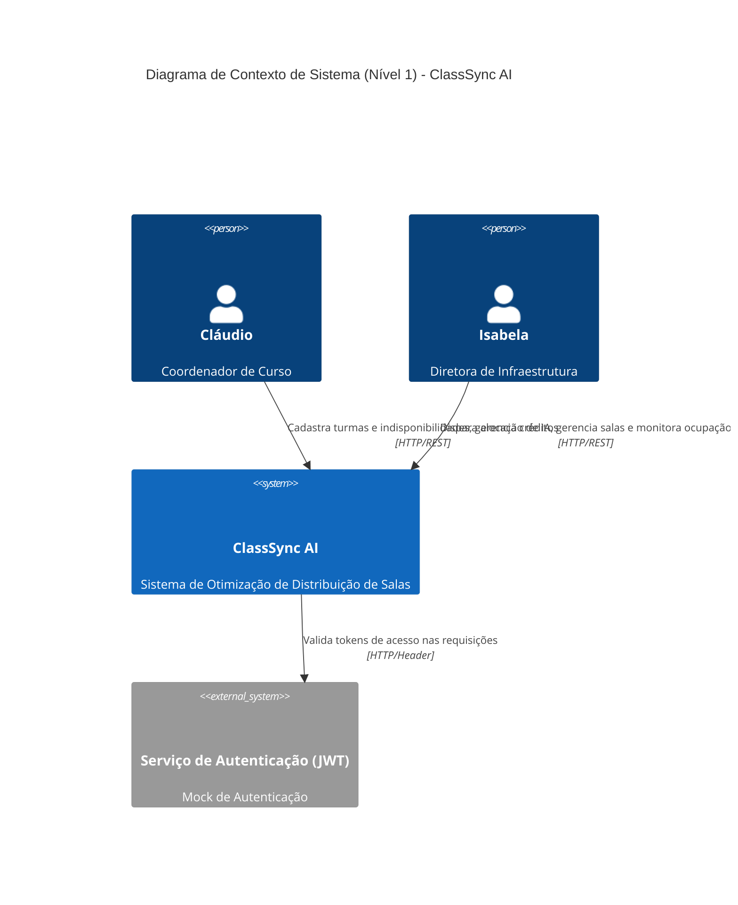

# Visão Geral Arquitetural — ClassSync AI

Este documento fornece a visão geral arquitetural do ClassSync AI (balcao), detalhando a estrutura do sistema, tecnologias utilizadas, diagramas C4 e de Entidade-Relacionamento (ERD), bem como as dívidas técnicas e lacunas críticas mapeadas.

---

## 1. Visão Geral do Sistema

O ClassSync AI é projetado para automatizar a distribuição e otimização de salas de aula físicas em um campus acadêmico. A arquitetura segue um padrão de API REST monolítica com processamento assíncrono em background para o motor de otimização de IA (baseado em agentes autônomos cooperativos e algoritmos gulosos de consolidação predial).

### Módulos Principais
1.  **core-allocation-engine**: O motor inteligente de alocação de salas e arbitragem cooperativa via leilão multiagente (ACCs e AMR) e consolidação energética (`BuildingOptimizer`).
2.  **academic-space-manager**: Gerenciador da API REST (FastAPI) e controle de cadastros, importações e restrições.
3.  **occupancy-dashboard**: Interface SPA estática em HTML/CSS para monitoramento e controle administrativo.

---

## 2. Diagrama de Contexto C4 (Nível 1)

O ClassSync AI interage com os coordenadores de curso (Cláudio), os diretores de infraestrutura (Isabela) e um serviço mockado de autenticação JWT para validação de segurança.



---

## 3. Modelo de Entidade-Relacionamento (ERD)

Este diagrama representa o modelo lógico das entidades persistidas (ou simuladas em memória) e as tabelas relacionais físicas criadas pelo script SQL.

```mermaid
erDiagram
    Coordination {
        UUID id PK
        VARCHAR name
        INTEGER credits
    }
    AllocationTask {
        UUID id PK
        VARCHAR status
        TIMESTAMP created_at
        TIMESTAMP updated_at
        INTEGER progress
        TEXT error_log
        JSONB result_summary
    }
    AuctionBid {
        UUID id PK
        UUID task_id FK
        UUID room_id
        VARCHAR time_slot
        UUID winner_coordination_id
        UUID loser_coordination_id
        INTEGER credits_spent
        TIMESTAMP timestamp
    }
    Room {
        UUID id PK
        VARCHAR name
        VARCHAR block_id
        INTEGER capacity
        VARCHAR room_type
        BOOLEAN is_accessible
        ARRAY features
    }
    Teacher {
        VARCHAR id PK
        VARCHAR name
        VARCHAR email
    }
    Restriction {
        UUID id PK
        VARCHAR teacher_id FK
        INTEGER day_of_week
        VARCHAR time_slot_id
    }
    Class {
        VARCHAR id PK
        INTEGER students_count
        VARCHAR room_type
        VARCHAR time_slot
        VARCHAR coordination_id FK
        INTEGER urgency
        BOOLEAN require_accessibility
    }

    AllocationTask ||--o{ AuctionBid : "audita"
    Coordination ||--o{ Class : "gerencia"
    Teacher ||--o{ Restriction : "possui"
```

---

## 4. Dívidas Técnicas e Lacunas Críticas

Durante a engenharia reversa do projeto, foram identificados desvios e problemas arquiteturais relevantes que necessitam de intervenção na fase de evolução (Forward):

### 4.1 Endpoints Inexistentes (Lacuna Crítica) — 🔴 LACUNA
*   **Descrição**: O dashboard frontend (`index.html`) tenta realizar chamadas Ajax para os endpoints `/api/v1/allocation/run` (disparar a alocação) e `/api/v1/allocation/status/{task_id}` (monitorar progresso da tarefa em background). Contudo, estas rotas não estão registradas em `routes.py`, embora o worker (`worker.py`) possua as funções `enqueue_allocation_run` e `execute_allocation_task`. O frontend atualmente exibe dados mockados estáticos no dashboard.

### 4.2 Desacoplamento da Persistência SQL — 🔴 LACUNA
*   **Descrição**: Há um script de DDL de banco de dados (`db/migrations.sql`) que cria as tabelas `AllocationTask` e `AuctionBid` visando persistência física e relacional. No entanto, o backend ignora este banco e utiliza coleções voláteis em memória no arquivo `worker.py` (`db_rooms`, `db_restrictions`, `db_tasks`, etc.). O banco de dados PostgreSQL especificado não está conectado operacionalmente à API FastAPI.

### 4.3 Segurança Mockada — 🟢 CONFIRMADO / 🟡 INFERIDO
*   **Descrição**: A validação do token JWT (`check_jwt_auth` em `routes.py`) é um mock simples de String. Ela apenas valida se o token é diferente de `"invalid-token"` e se possui o prefixo `"Bearer "`, sem decodificar assinaturas criptográficas reais ou expirar sessões.

### 4.4 Limite de Concorrência do Worker — 🟢 CONFIRMADO
*   **Descrição**: O pool de threads em background possui um limitador fixo de 2 execuções simultâneas (`ThreadPoolExecutor(max_workers=2)`). Em cenários de alta concorrência acadêmica, requisições adicionais ficarão enfileiradas indefinidamente.
