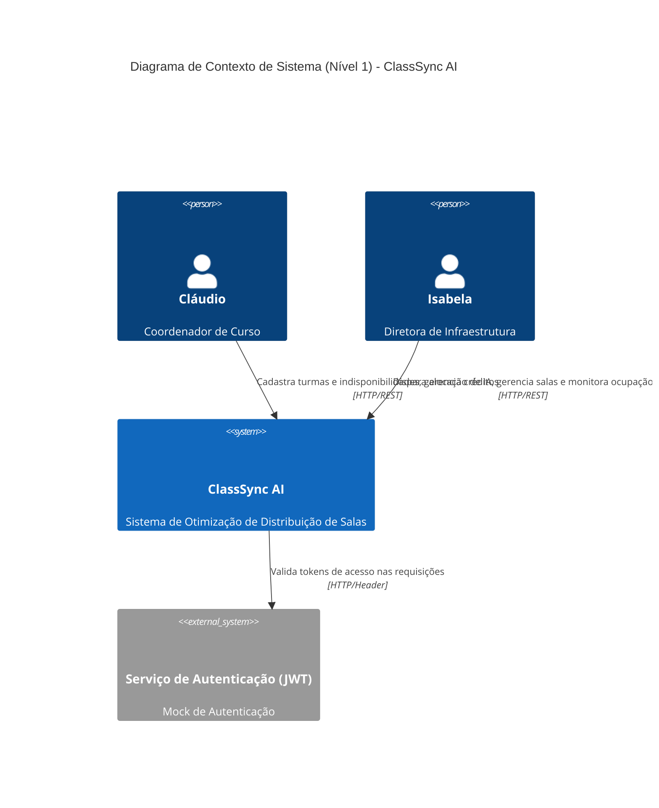

# Diagrama C4 Context — ClassSync AI

Este documento descreve o Diagrama de Contexto de Sistema (Nível 1) do ClassSync AI, mapeando os usuários, sistemas externos e as relações de alto nível.

---

## 1. Diagrama de Contexto (Mermaid)

---

## 2. Elementos de Sistema e Personas

### 2.1 Personas

*   **Cláudio (Coordenador de Curso)**: 🟢 **CONFIRMADO**
    *   *Papel*: Representa a coordenação acadêmica de curso (ex: Engenharia, Letras, Medicina). Ele insere os dados de entrada de indisponibilidade de professores e requisitos de espaço físico de suas turmas. Possui uma carteira de créditos para que seu respectivo Agente Coordenador de Curso (ACC) dispute salas no leilão.
*   **Isabela (Diretora de Infraestrutura)**: 🟢 **CONFIRMADO**
    *   *Papel*: Representa a administração geral do campus. Ela gerencia o cadastro e a exclusão de salas de aula e é responsável por iniciar a rodada de alocação de IA. Seu foco principal é analisar a economia energética decorrente da desativação de blocos subutilizados.

### 2.2 Sistemas

*   **ClassSync AI (Sistema Central)**: 🟢 **CONFIRMADO**
    *   *Papel*: O sistema central que hospeda a API REST (FastAPI), a lógica em background (worker de threads), e o motor inteligente composto pelos Agentes Coordenadores de Curso (ACC), Agente Mediador e Reputação (AMR) e o consolidador de blocos (BuildingOptimizer).
*   **Serviço de Autenticação JWT**: 🟢 **CONFIRMADO**
    *   *Papel*: Módulo interno que intercepta as chamadas à API REST e valida o cabeçalho `Authorization` exigindo um token do tipo Bearer para garantir a segurança nos endpoints protegidos.

---

## 3. Relações e Fluxos Principais

1.  **Gerenciamento de Espaço e Indisponibilidades**:
    *   *Cláudio* cadastra indisponibilidades docentes via `POST /allocation/restrictions` e *Isabela* cadastra salas via `POST /rooms` ou em lote via `POST /rooms/import-csv`. Todas essas requisições trafegam sob o protocolo HTTP/REST protegidas por Bearer Token.
2.  **Disparo e Acompanhamento da Otimização**:
    *   *Isabela* dispara a rodada de alocação no frontend. O frontend envia a requisição de execução e inicia o polling de status.
    *   🔴 **LACUNA CRÍTICA**: Os fluxos de disparo de alocação e consulta de status (`POST /api/v1/allocation/run` e `GET /api/v1/allocation/status/{task_id}`) não possuem rotas correspondentes implementadas no backend (`routes.py`). Portanto, esta integração de fluxo de contexto está atualmente quebrada no projeto legado.
3.  **Arbitragem e Compensação**:
    *   O motor resolve conflitos internamente utilizando o leilão cooperativo entre coordenações, cujos registros de lances deveriam ser persistidos na tabela `AuctionBid` e o status das tarefas na tabela `AllocationTask`.
    *   🔴 **LACUNA**: Não há persistência no banco relacional SQL real configurado no backend; os dados são gravados em coleções temporárias em memória de forma volátil.
