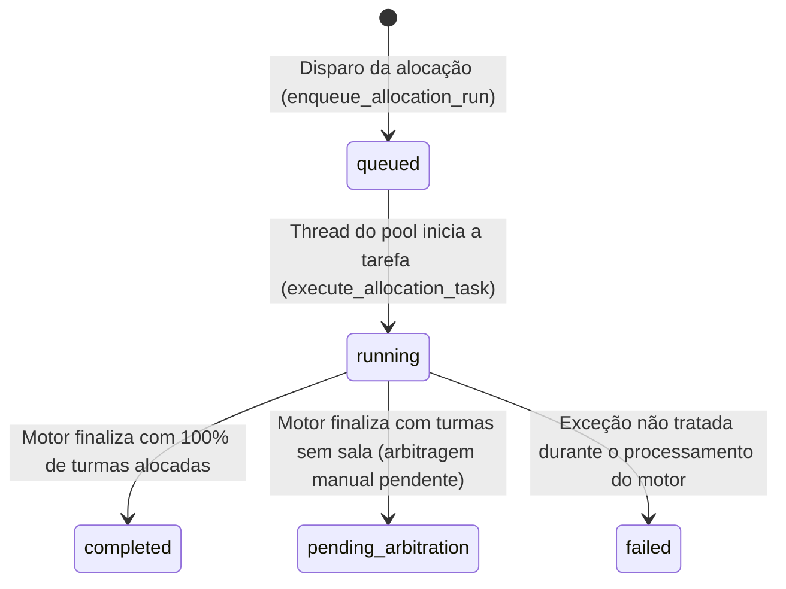
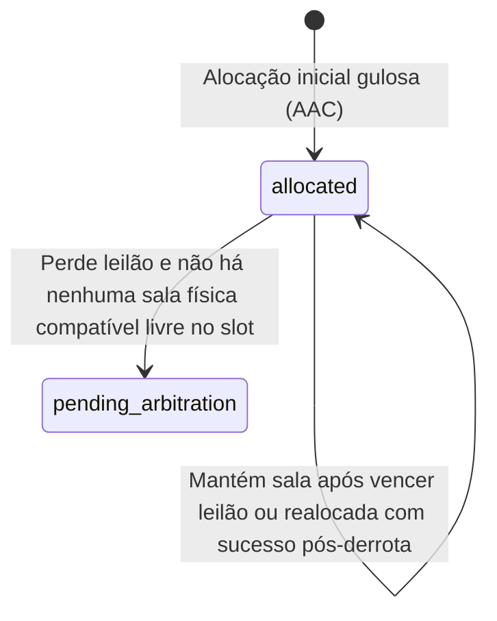

# Máquinas de Estado do Domínio: ClassSync AI (balcao)

Este documento mapeia os ciclos de vida e máquinas de estado das entidades transacionais do ClassSync AI.

---

## 1. Ciclo de Vida da Tarefa de Alocação (AllocationTask)

A entidade `AllocationTask` representa a execução assíncrona do motor inteligente de alocação de salas, gerenciada pelo pool de threads do worker em background.

### 1.1 Diagrama de Estados (AllocationTask)

### 1.2 Descrição dos Estados e Transições

*   **queued (Em Fila)**
    *   *Descrição*: A tarefa de alocação foi instanciada com progresso `0%` e inserida na fila de processamento assíncrono.
    *   *Entrada*: Invocação do botão "Disparar Alocação de IA" no frontend (esperado mapeamento para `/api/v1/allocation/run`).
*   **running (Processando)**
    *   *Descrição*: O motor de IA assumiu a tarefa, executando a alocação inicial (AAC), arbitragem de concorrência via leilões e otimização predial. Progresso varia de `10%` a `60%`.
    *   *Transição para running*: Ocorre automaticamente quando a thread do `ThreadPoolExecutor` retira a tarefa da fila e inicia a execução da função `execute_allocation_task()`.
*   **completed (Concluída)**
    *   *Descrição*: O processamento finalizou com sucesso. Todas as turmas cadastradas foram alocadas em salas físicas sem nenhuma colisão pendente. Progresso atinge `100%`.
    *   *Transição para completed*: Ocorre se, ao término de `run_allocation()`, nenhuma turma estiver marcada com o status `"pending_arbitration"`.
*   **pending_arbitration (Arbitragem Pendente)**
    *   *Descrição*: O processamento finalizou com sucesso, porém o motor de IA não conseguiu acomodar todas as turmas devido a restrições de capacidade física ou conflitos de horário insuperáveis. Algumas turmas requerem arbitragem humana para a escolha manual de sala. Progresso atinge `100%`.
    *   *Transição para pending_arbitration*: Ocorre se, ao término de `run_allocation()`, pelo menos uma das turmas na coleção de alocações possuir o status `"pending_arbitration"`.
*   **failed (Falha)**
    *   *Descrição*: O processamento foi interrompido abruptamente por um erro de execução. O log de erro é capturado e gravado na propriedade `error_log` da tarefa. Progresso é zerado.
    *   *Transição para failed*: Disparada por qualquer exceção interna capturada no bloco `try...except` do worker.

---

## 2. Ciclo de Vida da Alocação de Turma (Allocation)

Representa o status individual da alocação de cada disciplina às salas físicas.

### 2.1 Diagrama de Estados (Allocation)

### 2.2 Descrição das Transições de Alocação

1.  **Alocação Inicial**: Toda turma inicia no estado `allocated` (Alocada), sendo atribuída a ela uma sala de tamanho mais justo que atenda às suas restrições básicas (capacidade, acessibilidade, tipo, recursos).
2.  **Transição pós-colisão (Vitória)**: Se houver colisão de horário por uma sala física, a coordenação correspondente compete no leilão via `make_bid()`. O vencedor do leilão cooperativo mantém a alocação no estado `allocated` na mesma sala física.
3.  **Transição pós-colisão (Derrota com Realocação)**: A turma perdedora do leilão é temporariamente desalocada. O motor varre o inventário por salas físicas alternativas compatíveis que estejam livres. Se encontrar, realloca a turma para a nova sala mantendo o estado `allocated`.
4.  **Transição para arbitragem pendente**: Se a turma perdedora não encontrar nenhuma sala livre compatível no mesmo horário no campus, ela passa para o estado `pending_arbitration` (Arbitragem Pendente) e sua sala física (`room_id`) é redefinida como `None`.
